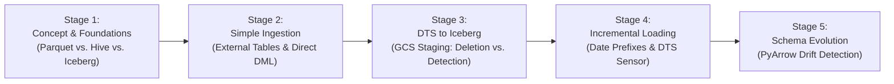

# BigLake, Apache Iceberg, and BigQuery Pipeline Playbook
### Enterprise Lakehouse Architecture, Ingestion Patterns, and Migration Guidance on Google Cloud

[](https://cloud.google.com/bigquery)
[](https://iceberg.apache.org/)
[](https://airflow.apache.org/)
[]()

---

## 📖 Executive Summary & Playbook Purpose

This repository serves as a **practical demonstration and architectural guidance playbook** for building modern, open Data Lakehouses on **Google Cloud Platform (GCP)**. It integrates **BigQuery**, **BigLake Managed Tables (Apache Iceberg)**, **Cloud Storage (GCS)**, **BigQuery Data Transfer Service (DTS)**, and **Apache Airflow**.

> **Context & Architectural Decisions:**  
> - **Why DTS?** In many enterprise settings, teams choose BigQuery DTS to preserve operational consistency and ease of configuration. While DTS has specific limitations (such as no direct database extraction and no native auto-schema evolution for Iceberg destinations), this playbook demonstrates how to overcome these limitations by combining lightweight Python extraction, GCS staging, and Airflow API orchestration.
> - **GCS Staging Lifecycle Scenarios:** When staging Parquet files for DTS ingestion, two technical options are implemented:
>   1. **Scenario A (Post-Ingestion File Deletion):** Ephemeral staging; processed Parquet files are automatically deleted after DTS completes, keeping the landing bucket clean.
>   2. **Scenario B (Filename & Prefix Detection Without Deletion):** Immutable staging; files are permanently retained in GCS (e.g. `export_YYYYMMDD/` or dynamic filenames) for auditability and replay, using prefix/filename detection to prevent duplicate ingestion.
> - **Demo + Guidance Scope:** The sample data volumes in this repository are intentionally compact and reproducible so engineers can validate concepts quickly in sandbox GCP environments without incurring high compute costs.

---

## 🗺️ Progressive 5-Stage Learning Roadmap

The playbook is structured as a step by step progression from foundational lakehouse concepts to hardened, production style automated pipelines:



---

## 📚 Documentation Index

| Stage | Section & Topic | Core Concepts | Linked Assets |
| :---: | :--- | :--- | :--- |
| **Stage 1** | **[01. Concepts & Architecture](docs/01_concept_why_biglake_and_iceberg/01_biglake_iceberg_concepts.md)** | Comparison of Parquet, Hive Partitioning, and Iceberg metadata layers; ACID transactions; Time travel. | - |
| **Stage 1** | **[02. Connection & IAM Setup](docs/01_concept_why_biglake_and_iceberg/02_biglake_connection_and_iam.md)** | Cloud Resource Connection creation; IAM delegation; `Storage Object Admin` vs `Storage Object Viewer`. | - |
| **Stage 1** | **[03. Migration: Hive to Managed Iceberg](docs/01_concept_why_biglake_and_iceberg/03_poc_hive_to_managed_iceberg.md)** | Hands-on migration of public NYC Taxi data into Iceberg; testing row-level `UPDATE` and `DELETE`. | [`sql/02_ddl_poc_nyc_taxi_iceberg.sql`](sql/02_ddl_poc_nyc_taxi_iceberg.sql) |
| **Stage 1** | **[04. Time Travel and Fail-safe](docs/01_concept_why_biglake_and_iceberg/04_time_travel_and_fail-safe.md)** | Understanding physical file retention in Iceberg  | - |
| **Stage 2** | **[05. Simple Parquet External Tables](docs/02_simple_ingestion/04_simple_parquet_external_table.md)** | Read-only external table (not iceberg) mapping over GCS; PyArrow to BigQuery data type mapping matrix; immutability rules. | [`sql/01_ddl_external_parquet.sql`](sql/01_ddl_external_parquet.sql) |
| **Stage 2** | **[06. Direct SQL MySQL to Iceberg](docs/02_simple_ingestion/05_mysql_to_iceberg_direct_sql.md)** | simple loading CDC into Iceberg via JSON UNNEST DML; 2-tier Medallion MERGE upsert. | [`sql/03_ddl_mysql_staging_and_native.sql`](sql/03_ddl_mysql_staging_and_native.sql)<br/>[`dags/dag_05_mysql_direct_sql.py`](dags/dag_05_mysql_direct_sql.py) |
| **Stage 3** | **[07. DTS Parquet Staging & Migration](docs/03_dts_to_iceberg/06_dts_parquet_migration.md)** | GCS Staging Strategies: **Scenario A** (Post-Ingestion Deletion) vs. **Scenario B** (Filename Detection); timestamp precision (`coerce_timestamps='us'`). | - |
| **Stage 3** | **[08. DTS Airflow Orchestration & Lifecycles](docs/03_dts_to_iceberg/07_dts_parquet_airflow_orchestration.md)** | Airflow triggering DTS via API; Managing GCS Staging Lifecycles (Deletion vs. Retention); Iceberg snapshots and Garbage Collection. | [`dags/dag_07_dts_parquet_to_iceberg.py`](dags/dag_07_dts_parquet_to_iceberg.py) |
| **Stage 4** | **[09. Dynamic Filename Detection Batching](docs/04_incremental_loading/08_dts_full_and_incremental_load.md)** | **Scenario B in Action**: Dynamic Filename Detection for cold starts (`full_load.parquet`) vs daily deltas (`incremental_YYYYMMDD.parquet`) without deleting historical files. | [`dags/dag_08_dts_full_and_incremental.py`](dags/dag_08_dts_full_and_incremental.py) |
| **Stage 4** | **[10. Canonical Date-Prefix Reference Pipeline](docs/04_incremental_loading/09_reference_pipeline_date_prefix_sensor.md)** | **Canonical Reference Implementation**: Immutable Date-Prefix Detection (`export_YYYYMMDD/`) with Zero File Deletion; DTS Sensor; partition-pruned MERGE. | [`sql/04_ddl_reference_staging_and_native.sql`](sql/04_ddl_reference_staging_and_native.sql)<br/>[`sql/05_merge_staging_to_native.sql`](sql/05_merge_staging_to_native.sql)<br/>[`dags/dag_09_reference_pipeline_date_prefix.py`](dags/dag_09_reference_pipeline_date_prefix.py) |
| **Stage 5** | **[11. Automated Schema Evolution](docs/05_schema_evolution/10_automated_schema_evolution_iceberg.md)** | Resolving DTS lack of auto-schema evolution on Iceberg; PyArrow metadata drift detection; automated `ALTER TABLE` DDL. | [`scripts/simulate_mysql_producer.py`](scripts/simulate_mysql_producer.py)<br/>[`dags/dag_10_schema_evolution_iceberg.py`](dags/dag_10_schema_evolution_iceberg.py) |

---

## 🗂️ Repository Structure

```text
biglake-iceberg-bq/
├── README.md                                          # Master playbook index and architecture portal
├── CHANGELOG.md                                       # Detailed audit log of all refactoring & fixes
├── docs/                                              # 5-stage progressive documentation
│   ├── 01_concept_why_biglake_and_iceberg/
│   │   ├── 01_biglake_iceberg_concepts.md             # Parquet vs Hive vs Iceberg fundamentals
│   │   ├── 02_biglake_connection_and_iam.md           # BigLake connection setup & IAM delegation
│   │   ├── 03_poc_hive_to_managed_iceberg.md          # Public NYC Taxi POC
|   |   └── 04_time_travel_and_fail-safe.md            # Storage retention behavior
│   ├── 02_simple_ingestion/
│   │   ├── 05_simple_parquet_external_table.md        # External Parquet tables & type mappings
│   │   └── 06_mysql_to_iceberg_direct_sql.md          # MySQL direct SQL insertion prototype
│   ├── 03_dts_to_iceberg/
│   │   ├── 07_dts_parquet_migration.md                # GCS Staging: Post-Ingestion Deletion vs. Filename Detection
│   │   └── 08_dts_parquet_airflow_orchestration.md    # Airflow DTS orchestration & Staging Lifecycle
│   ├── 04_incremental_loading/
│   │   ├── 09_dts_full_and_incremental_load.md        # Dynamic Filename Detection (Full vs. Incremental)
│   │   └── 10_reference_pipeline_date_prefix_sensor.md# Canonical Reference: Immutable Date-Prefix Detection
│   └── 05_schema_evolution/
│       └── 11_automated_schema_evolution_iceberg.md   # PyArrow schema drift detection workaround
├── dags/                                              # Standalone Apache Airflow DAGs
│   ├── dag_05_mysql_direct_sql.py                     # Stage 2: MySQL to Iceberg via JSON UNNEST
│   ├── dag_07_dts_parquet_to_iceberg.py               # Stage 3: Orchestrating DTS & Staging Options
│   ├── dag_08_dts_full_and_incremental.py             # Stage 4: Dynamic cold-start via Filename Detection
│   ├── dag_09_reference_pipeline_date_prefix.py       # Stage 4: Canonical Immutable Date-Prefix & DTS Sensor
│   └── dag_10_schema_evolution_iceberg.py             # Stage 5: Schema drift detection & ALTER TABLE DDL
├── sql/                                               # Standalone BigQuery SQL DDL and DML scripts
│   ├── 01_ddl_external_parquet.sql                    # External Parquet table creation & CTAS
│   ├── 02_ddl_poc_nyc_taxi_iceberg.sql                # NYC Taxi external and managed Iceberg DDL/DML
│   ├── 03_ddl_mysql_staging_and_native.sql            # Stage 2 user migration staging & serving DDL
│   ├── 04_ddl_reference_staging_and_native.sql        # Stage 4 banking reference DDL
│   └── 05_merge_staging_to_native.sql                 # Partition-pruned templated BigQuery MERGE
└── scripts/                                           # Simulation and testing utility scripts
    └── simulate_mysql_producer.py                     # Schema drift simulation (Day 1 vs Day 2 columns)
```

---

## ⚡ Quickstart & Deployment Cheat Sheet

### 1. Prerequisites Check
Before running any DAGs:
1. Ensure your BigLake Cloud Resource connection is provisioned:
   ```bash
   bq mk --connection --location=asia-southeast2 \
     --connection_type=CLOUD_RESOURCE biglake-data-connection
   ```
2. Retrieve the connection's Service Account and grant it **Storage Object Admin** (`roles/storage.objectAdmin`) on your target GCS bucket.
3. Grant your Airflow execution identity **BigQuery Connection User** (`roles/bigquery.connectionUser`) on the connection.

### 2. Run the Canonical Reference Pipeline (Stage 4)
For a complete demonstration of enterprise lakehouse ingestion:
1. Run [`sql/04_ddl_reference_staging_and_native.sql`](sql/04_ddl_reference_staging_and_native.sql) in BigQuery Studio.
2. Create an On-demand DTS transfer with URI:
   `gs://<YOUR_BUCKET>/data_transaksi/export_{run_time+7h|"%Y%m%d"}/*.parquet`
3. Update connection and resource IDs in [`dags/dag_09_reference_pipeline_date_prefix.py`](dags/dag_09_reference_pipeline_date_prefix.py) and deploy to Airflow.
4. Trigger the DAG in Airflow UI. The pipeline will:
   - Generate test transaction records in MySQL.
   - Detect that the destination table is empty and execute an initial extract.
   - Coerce timestamps to UTC microsecond precision.
   - Stage Parquet files in date-prefixed folders.
   - Trigger BigQuery DTS and poll using `BigQueryDataTransferServiceTransferRunSensor`.
   - Merge records into `final_transaksi` with partition pruning and soft-delete handling.

### 3. Test Automated Schema Evolution (Stage 5)
To observe dynamic schema synchronization:
```bash
# Day 1: Baseline upload
python scripts/simulate_mysql_producer.py --day 1 --bucket <YOUR_BUCKET> --prefix staging/

# Day 2: Schema drift (introduces new columns)
python scripts/simulate_mysql_producer.py --day 2 --bucket <YOUR_BUCKET> --prefix staging/

# Trigger dag_10_schema_evolution_iceberg in Airflow UI to alter table schema and ingest via DTS
```

---

## 🛡️ Best Practices & Enterprise Hardening Rules

1. **Storage Role for BigLake Managed Tables:**  
   Always grant `roles/storage.objectAdmin` (not just `objectViewer`) to the BigLake connection SA, as BigQuery must write manifests and delete expired files.
2. **PyArrow Timestamp Precision:**  
   Always export Parquet files with `coerce_timestamps='us'` and UTC timezone. BigQuery rejects nanosecond timestamps (`TIMESTAMP_NANOS`) during load operations.
3. **Eliminate DTS Race Conditions:**  
   Because `BigQueryDataTransferServiceStartTransferRunsOperator` returns asynchronously, always pair it with `BigQueryDataTransferServiceTransferRunSensor` before triggering downstream MERGE operations.
4. **Partition Pruning on MERGE Queries:**  
   Always include the target table's partition column in the `ON` condition (e.g. `AND T.tanggal_transaksi = S.tanggal_transaksi`) to prevent BigQuery from performing expensive full-table scans.
