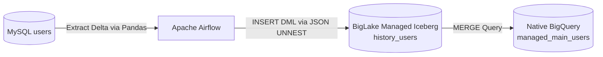

# Stage 2: Simple Ingestion
## Part 2.2: MySQL CDC to Iceberg via Direct SQL (Educational Prototype)

> **Section Overview:**  
> This section demonstrates a direct relational-to-lakehouse migration pipeline from MySQL into a BigLake Managed Iceberg table (`history_users`), followed by an idempotent MERGE into a native BigQuery serving table (`managed_main_users`). It explores how SQL DML can be used directly on Iceberg tables via JSON UNNEST, and explains why enterprise production pipelines transition to DTS + GCS staging.

---

## Standalone Code Assets
* **SQL DDL & Queries:** [`sql/03_ddl_mysql_staging_and_native.sql`](../../sql/03_ddl_mysql_staging_and_native.sql)
* **Airflow DAG:** [`dags/dag_05_mysql_direct_sql.py`](../../dags/dag_05_mysql_direct_sql.py)

---

## 1. Architecture: Two-Tier Medallion Pattern

The architecture employs a two-tier approach to balance storage costs, historical auditability, and query performance:
1. **History Layer (Bronze / Staging):** Uses **Apache Iceberg (BigLake Managed Table)** backed by Google Cloud Storage (GCS). This layer acts as an append-only staging area for all incoming data and historical state changes.
2. **Main Layer (Gold / Production Serving):** Uses **BigQuery Native Tables**. This layer reflects the deduplicated, latest state of the data by merging changes from the History layer and resolving soft deletes.



---

## 2. Data Type Mapping (MySQL to BigQuery)

| MySQL Data Type | BigQuery Equivalent | Technical Notes |
| :--- | :--- | :--- |
| `TINYINT`, `SMALLINT`, `INT`, `BIGINT` | `INT64` | BigQuery handles all integers as 64-bit integers. |
| `VARCHAR`, `CHAR`, `TEXT`, `LONGTEXT` | `STRING` | BigQuery `STRING` values must be UTF-8 encoded. |
| `DATETIME`, `TIMESTAMP` | `TIMESTAMP` or `DATETIME` | Use `TIMESTAMP` for absolute UTC point-in-time; `DATETIME` for civil time. |
| `DATE` | `DATE` | Maps directly. |
| `FLOAT`, `DOUBLE` | `FLOAT64` | BigQuery uses 64-bit IEEE floating-point. |
| `DECIMAL`, `NUMERIC` | `NUMERIC` or `BIGNUMERIC` | `NUMERIC` supports 38 digits; `BIGNUMERIC` supports 76 digits. |
| `TINYINT(1)`, `BOOLEAN`, `BOOL` | `BOOL` | Represents `TRUE` or `FALSE`. |
| `JSON` | `JSON` or `STRING` | BigQuery supports native semi-structured `JSON`. |
| `BLOB`, `BINARY` | `BYTES` | Used for raw byte arrays. |

---

## 3. Database Schema (DDL)

### 3.1. Source: MySQL Table
```sql
DROP TABLE IF EXISTS users;

CREATE TABLE users (
    id VARCHAR(50) PRIMARY KEY,
    name VARCHAR(100),
    email VARCHAR(100) NULL,
    created_at DATETIME NOT NULL,
    updated_at DATETIME NOT NULL,
    deleted_at DATETIME NULL
);
```

### 3.2. Staging: BigQuery Iceberg Managed Table (History Layer)
```sql
CREATE OR REPLACE TABLE `<YOUR_PROJECT_ID>.<YOUR_DATASET>.history_users`
(
    id STRING,
    name STRING,
    email STRING,
    created_at TIMESTAMP,
    updated_at TIMESTAMP,
    deleted_at TIMESTAMP
)
PARTITION BY DATE(created_at) 
WITH CONNECTION `<YOUR_REGION>.<YOUR_CONNECTION_ID>`
OPTIONS (
    file_format = 'PARQUET',
    table_format = 'ICEBERG',
    storage_uri = 'gs://<YOUR_BUCKET_NAME>/history_users_iceberg/' 
);
```

> [!NOTE]
> **Hidden Partitioning in Iceberg**: Unlike Hive external tables, you will not see folder paths like `created_at=2026-08-20/` in GCS. Iceberg maintains partition boundaries inside metadata manifests, preventing folder lock-in and allowing schema/partition evolution without table re-writes.

### 3.3. Serving: BigQuery Native Table (Main Layer)
```sql
CREATE OR REPLACE TABLE `<YOUR_PROJECT_ID>.<YOUR_DATASET>.managed_main_users`
(
    id STRING,
    name STRING,
    email STRING,
    created_at TIMESTAMP,
    updated_at TIMESTAMP,
    deleted_at TIMESTAMP
)
PARTITION BY DATE(created_at);
```

---

## 4. Ingestion Mechanism: Direct SQL via JSON UNNEST

Standard BigQuery Load APIs (`bq load` or `to_gbq`) do not currently support direct streaming/loading into BigLake Managed Iceberg tables. Attempting to use the load job API returns a `403 Delegate Permission` or unsupported destination error.

As an educational prototype for small demo datasets, this DAG demonstrates loading by serializing DataFrame records into JSON and executing a parameterized BigQuery `INSERT` query:

```sql
INSERT INTO `<YOUR_PROJECT_ID>.<YOUR_DATASET>.history_users` 
  (id, name, email, created_at, updated_at, deleted_at)
SELECT 
    JSON_VALUE(json_row, '$.id'),
    JSON_VALUE(json_row, '$.name'),
    JSON_VALUE(json_row, '$.email'),
    CAST(JSON_VALUE(json_row, '$.created_at') AS TIMESTAMP),
    CAST(JSON_VALUE(json_row, '$.updated_at') AS TIMESTAMP),
    CAST(JSON_VALUE(json_row, '$.deleted_at') AS TIMESTAMP)
FROM UNNEST(JSON_QUERY_ARRAY(@json_str, '$')) AS json_row;
```

> [!WARNING]
> **Scaling & Production Notice:**  
> While the JSON UNNEST approach works effectively for demo workloads (< 5,000 rows), BigQuery has a query string and parameter size limit (1 MB). For production datasets, data should be written to GCS as Parquet and loaded using **BigQuery Data Transfer Service (DTS)**, which is covered in Stages 3 and 4.

---

## 5. Merging Staging to Native Serving

Once new updates land in `history_users`, an idempotent `MERGE` updates the native serving table, transforming soft-deletes into hard deletes:

```sql
MERGE `<YOUR_PROJECT_ID>.<YOUR_DATASET>.managed_main_users` T
USING (
  SELECT * EXCEPT(rn)
  FROM (
    SELECT 
      *, 
      ROW_NUMBER() OVER(PARTITION BY id ORDER BY updated_at DESC) as rn
    FROM `<YOUR_PROJECT_ID>.<YOUR_DATASET>.history_users`
    -- Read optimization: Scan only the last 2 days of history
    WHERE updated_at >= TIMESTAMP(DATETIME_SUB(CURRENT_DATETIME('Asia/Jakarta'), INTERVAL 2 DAY))
  )
  WHERE rn = 1
) S
ON T.id = S.id

-- Scenario 1: Soft Delete in source -> Hard Delete in serving
WHEN MATCHED AND S.deleted_at IS NOT NULL THEN 
  DELETE
  
-- Scenario 2: Update existing record
WHEN MATCHED AND S.deleted_at IS NULL THEN
  UPDATE SET 
    T.name = S.name, 
    T.email = S.email, 
    T.updated_at = S.updated_at
    
-- Scenario 3: Insert new record
WHEN NOT MATCHED AND S.deleted_at IS NULL THEN
  INSERT (id, name, email, created_at, updated_at, deleted_at) 
  VALUES (S.id, S.name, S.email, S.created_at, S.updated_at, S.deleted_at);
```

---

## Next Steps:
To scale beyond direct SQL query size limits by leveraging automated GCS Parquet staging and BigQuery Data Transfer Service (DTS), proceed to **Stage 3: Using DTS to Ingest into Iceberg**:  
**[../03_dts_to_iceberg/06_dts_parquet_migration.md](../03_dts_to_iceberg/06_dts_parquet_migration.md)**
