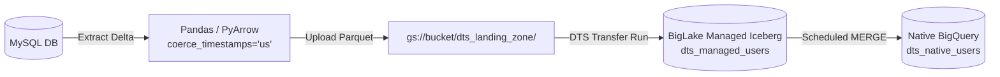

# Stage 3: Using DTS to Ingest into Iceberg
## Part 3.1: GCS Staging and BigQuery Data Transfer Service (DTS) Setup

> **Section Overview:**  
> In enterprise environments, maintaining consistency with existing data ingestion patterns often makes **BigQuery Data Transfer Service (DTS)** the preferred tool for file ingestion. However, DTS cannot ingest directly from relational databases like MySQL without an intermediary landing zone. This guide demonstrates how to combine lightweight Python extraction with GCS Parquet staging and DTS to append records into BigLake Managed Iceberg tables.

---

## 1. Architectural Concept & Flow

To bridge the gap between source databases and BigLake Managed Iceberg tables while bypassing the 1 MB SQL query parameter limit from Stage 2:

1. **Extraction (Airflow / Script):** Queries MySQL for the latest CDC window (e.g., past 24 hours).
2. **In-Memory Transformation:** Converts the extracted DataFrame into Parquet in-memory using `io.BytesIO()`.  
   *Crucial fix:* Explicitly forces microsecond timestamp precision (`coerce_timestamps='us'`) to avoid BigQuery nanosecond rejection errors.
3. **GCS Landing Zone:** Writes the Parquet file to `gs://<BUCKET>/dts_landing_zone/`.
4. **DTS Ingestion:** BigQuery DTS automatically detects new Parquet files, appends them to the BigLake Managed Iceberg table, and advances the Iceberg snapshot catalog.
5. **Serving Layer MERGE:** A BigQuery MERGE deduplicates history and updates the native serving table.



---

## 2. BigQuery Table Schemas (DDL)

### 2.1. Staging: BigLake Managed Iceberg Table (History Layer)
```sql
CREATE OR REPLACE TABLE `<YOUR_PROJECT_ID>.<YOUR_DATASET>.dts_managed_users`
(
    id STRING,
    name STRING,
    email STRING,
    created_at TIMESTAMP,
    updated_at TIMESTAMP,
    deleted_at TIMESTAMP
)
PARTITION BY DATE(created_at) 
WITH CONNECTION `<YOUR_REGION>.<YOUR_CONNECTION_ID>`
OPTIONS (
    file_format = 'PARQUET', 
    table_format = 'ICEBERG', 
    storage_uri = 'gs://<YOUR_BUCKET_NAME>/dts_iceberg_managed/'
);
```

### 2.2. Serving: BigQuery Native Table (Main Layer)
```sql
CREATE OR REPLACE TABLE `<YOUR_PROJECT_ID>.<YOUR_DATASET>.dts_native_users`
(
    id STRING,
    name STRING,
    email STRING,
    created_at TIMESTAMP,
    updated_at TIMESTAMP,
    deleted_at TIMESTAMP
)
PARTITION BY DATE(created_at);
```

---

## 3. Timestamp Precision: Why `coerce_timestamps='us'` Matters

By default, Python's `pandas` and `pyarrow` export datetime columns with **nanosecond precision** (`timestamp[ns]`).

> [!WARNING]
> **BigQuery Timestamp Incompatibility:**  
> BigQuery native `TIMESTAMP` and Iceberg schema specifications only support **microsecond precision** (`timestamp[us]`). If a Parquet file with nanoseconds is loaded via DTS, BigQuery fails with:
> ```text
> Field created_at has type TIMESTAMP_NANOS, which cannot be converted to target type TIMESTAMP
> ```
> To prevent this, always specify:
> ```python
> df.to_parquet(
>     parquet_buffer, 
>     engine='pyarrow', 
>     index=False,
>     coerce_timestamps='us',
>     allow_truncated_timestamps=True 
> )
> ```

---

## 4. BigQuery Data Transfer Service (DTS) Setup

Configure DTS via the BigQuery Console to automate ingestion into the Iceberg table:

1. Open **BigQuery Console** -> **Data transfers** -> **Create Transfer**.
2. **Source:** Google Cloud Storage.
3. **Transfer config name:** `Ingest_MySQL_Parquet_to_Iceberg`.
4. **Schedule:** On-demand (or scheduled 30 minutes after your extraction window).
5. **Destination dataset:** `<YOUR_DATASET>`.
6. **Destination table:** `dts_managed_users`.
7. **Cloud Storage URI:** `gs://<YOUR_BUCKET_NAME>/dts_landing_zone/*.parquet`.
8. **Write preference:** `APPEND`.
9. **File format:** `PARQUET`.
10. *(Optional)* Check **Delete source files after transfer** if your landing zone is temporary.

---

## 5. Merging to the Native Serving Table

After DTS appends the delta Parquet file into `dts_managed_users`, run a MERGE query to upsert into `dts_native_users`:

```sql
MERGE `<YOUR_PROJECT_ID>.<YOUR_DATASET>.dts_native_users` T
USING (
  SELECT * EXCEPT(rn) 
  FROM (
    SELECT 
      *, 
      ROW_NUMBER() OVER(PARTITION BY id ORDER BY updated_at DESC) as rn
    FROM `<YOUR_PROJECT_ID>.<YOUR_DATASET>.dts_managed_users`
    -- Scan optimization: Limit history lookback
    WHERE updated_at >= TIMESTAMP(DATETIME_SUB(CURRENT_DATETIME('Asia/Jakarta'), INTERVAL 2 DAY))
  ) 
  WHERE rn = 1
) S 
ON T.id = S.id

-- Scenario 1: Process Soft Deletes
WHEN MATCHED AND S.deleted_at IS NOT NULL THEN 
  DELETE
  
-- Scenario 2: Process Updates
WHEN MATCHED AND S.deleted_at IS NULL THEN 
  UPDATE SET 
    T.name = S.name, 
    T.email = S.email, 
    T.updated_at = S.updated_at
    
-- Scenario 3: Process New Inserts
WHEN NOT MATCHED AND S.deleted_at IS NULL THEN 
  INSERT (id, name, email, created_at, updated_at, deleted_at) 
  VALUES (S.id, S.name, S.email, S.created_at, S.updated_at, S.deleted_at);
```

---

## Next Steps in Stage 3:
To automate the extraction, DTS execution, and MERGE inside an end-to-end Airflow DAG, proceed to:  
**[07_dts_parquet_airflow_orchestration.md](07_dts_parquet_airflow_orchestration.md)**
