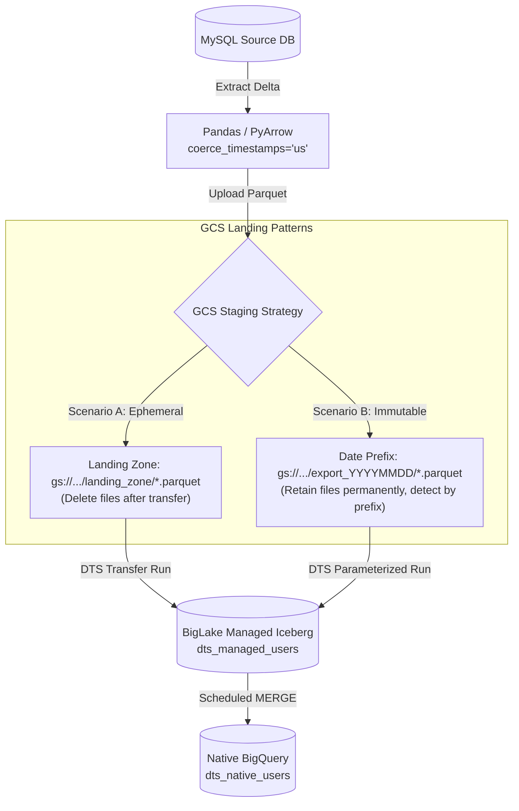

# Stage 3: Using DTS to Ingest into Iceberg
## Part 3.1: GCS Staging Strategies (Post-Ingestion Deletion vs. Filename Detection) & BigQuery DTS Setup

> **Section Overview & Core Staging Strategies:**  
> For simplicity and ease of use, **BigQuery Data Transfer Service (DTS)** is often the preferred tool for lakehouse ingestion. While BigQuery DTS now features a native MySQL connector [1](https://cloud.google.com/bigquery/docs/mysql-transfer), that connector only supports loading into proprietary BigQuery native tables. **DTS cannot ingest from MySQL directly into BigLake Managed Apache Iceberg tables.** Therefore, to land relational data into an open Iceberg lakehouse format using DTS, data must first be staged as Parquet files in Google Cloud Storage (GCS) using the DTS Cloud Storage transfer [2](https://cloud.google.com/bigquery/docs/cloud-storage-transfer).
>
> When designing the GCS staging layer for DTS ingestion, two primary operational scenarios exist:
> 
> 1. **Scenario A: Post-Ingestion File Deletion (Ephemeral Staging)**  
>    Processed Parquet files are explicitly deleted from GCS once the DTS transfer run succeeds (either via DTS's native *Delete source files after transfer* setting or an orchestrator cleanup task).  
>    * **When to use:** When GCS is treated strictly as a transient landing buffer, minimizing Cloud Storage storage costs and preventing duplicate ingestion when using a static wildcard URI (e.g., `gs://bucket/landing_zone/*.parquet`).
> 
> 2. **Scenario B: Filename & Prefix Detection Without Deleting (Immutable Lake Archive)**  
>    Processed Parquet files are **never deleted** from GCS, preserving an immutable, audit-compliant data lake archive for historical replay and disaster recovery.  
>    * **When to use:** When compliance, auditing, or operational resilience requires preserving raw source files. To avoid re-ingesting previously transferred data, DTS is configured with dynamic date-partitioned folder prefixes (e.g., `gs://bucket/data/export_YYYYMMDD/*.parquet`) or specific filename patterns matching runtime parameters.
>
> This guide details both staging patterns, how to configure GCS and DTS, and how to reliably append records into BigLake Managed Iceberg tables.

---

## 1. Architectural Concept & Flow

To bridge the gap between source databases and BigLake Managed Iceberg tables while bypassing the 1 MB SQL query parameter limit from Stage 2:

1. **Extraction (Airflow / Script):** Queries MySQL for the latest incremental watermark window (e.g., past 24 hours).
2. **In-Memory Transformation:** Converts the extracted DataFrame into Parquet in-memory using `io.BytesIO()`.  
   *Crucial fix:* Explicitly forces microsecond timestamp precision (`coerce_timestamps='us'`) to avoid BigQuery nanosecond rejection errors.
3. **GCS Landing Zone:** Writes the Parquet file to GCS:
   * *Under Scenario A:* Staged in an ephemeral folder `gs://<BUCKET>/dts_landing_zone/*.parquet`, wiped after ingestion.
   * *Under Scenario B:* Landed in a structured, permanent date-prefixed path `gs://<BUCKET>/data/export_YYYYMMDD/*.parquet` without deletion.
4. **DTS Ingestion:** BigQuery DTS automatically detects new Parquet files, appends them to the BigLake Managed Iceberg table, and advances the Iceberg snapshot catalog.
5. **Serving Layer MERGE:** A BigQuery MERGE deduplicates history and updates the native serving table.



---

## 2. BigQuery Table Schemas (DDL)

### 2.1. Staging: BigLake Managed Iceberg Table (History Layer)
Create the Iceberg managed table backed by Cloud Storage [3](https://cloud.google.com/bigquery/docs/biglake-iceberg-tables-in-bigquery#create-tables):
```sql
CREATE OR REPLACE TABLE `<YOUR_PROJECT_ID>.<YOUR_DATASET>.dts_managed_users`
(
    id STRING,
    name STRING,
    email STRING,
    created_at TIMESTAMP,
    updated_at TIMESTAMP,
    deleted_at TIMESTAMP
)
PARTITION BY DATE(created_at) 
WITH CONNECTION `<YOUR_REGION>.<YOUR_CONNECTION_ID>`
OPTIONS (
    file_format = 'PARQUET', 
    table_format = 'ICEBERG', 
    storage_uri = 'gs://<YOUR_BUCKET_NAME>/dts_iceberg_managed/'
);
```

### 2.2. Serving: BigQuery Native Table (Main Layer)
```sql
CREATE OR REPLACE TABLE `<YOUR_PROJECT_ID>.<YOUR_DATASET>.dts_native_users`
(
    id STRING,
    name STRING,
    email STRING,
    created_at TIMESTAMP,
    updated_at TIMESTAMP,
    deleted_at TIMESTAMP
)
PARTITION BY DATE(created_at);
```

---

## 3. Timestamp Precision: Why `coerce_timestamps='us'` Matters

By default, Python's `pandas` and `pyarrow` export datetime columns with **nanosecond precision** (`timestamp[ns]`).

> [!WARNING]
> **BigQuery Timestamp Incompatibility:**  
> BigQuery native `TIMESTAMP` and Iceberg schema specifications only support **microsecond precision** (`timestamp[us]`) [4](https://cloud.google.com/bigquery/docs/loading-data-cloud-storage-parquet#type_conversions) [5](https://arrow.apache.org/docs/python/generated/pyarrow.parquet.write_table.html). If a Parquet file with nanoseconds is loaded via DTS, BigQuery fails with:
> ```text
> Field created_at has type TIMESTAMP_NANOS, which cannot be converted to target type TIMESTAMP
> ```
> To prevent this, always specify:
> ```python
> df.to_parquet(
>     parquet_buffer, 
>     engine='pyarrow', 
>     index=False,
>     coerce_timestamps='us',
>     allow_truncated_timestamps=True 
> )
> ```

---

## 4. BigQuery Data Transfer Service (DTS) Setup

Configure DTS via the BigQuery Console to automate ingestion into the Iceberg table [2](https://cloud.google.com/bigquery/docs/cloud-storage-transfer):

1. Open **BigQuery Console** -> **Data transfers** -> **Create Transfer**.
2. **Source:** Google Cloud Storage.
3. **Transfer config name:** `Ingest_MySQL_Parquet_to_Iceberg`.
4. **Schedule:** On-demand (or scheduled 30 minutes after your extraction window).
5. **Destination dataset:** `<YOUR_DATASET>`.
6. **Destination table:** `dts_managed_users`.
7. **Cloud Storage URI:** `gs://<YOUR_BUCKET_NAME>/dts_landing_zone/*.parquet`.
8. **Write preference:** `APPEND`.
9. **File format:** `PARQUET`.
10. *(Optional)* Check **Delete source files after transfer** if your landing zone is temporary.

---

## 5. Merging to the Native Serving Table

After DTS appends the delta Parquet file into `dts_managed_users`, run a MERGE query to upsert into `dts_native_users` [6](https://cloud.google.com/bigquery/docs/reference/standard-sql/dml-syntax#merge_statement):

```sql
MERGE `<YOUR_PROJECT_ID>.<YOUR_DATASET>.dts_native_users` T
USING (
  SELECT * EXCEPT(rn) 
  FROM (
    SELECT 
      *, 
      ROW_NUMBER() OVER(PARTITION BY id ORDER BY updated_at DESC) as rn
    FROM `<YOUR_PROJECT_ID>.<YOUR_DATASET>.dts_managed_users`
    -- Scan optimization: Limit history lookback
    WHERE updated_at >= TIMESTAMP(DATETIME_SUB(CURRENT_DATETIME('Asia/Jakarta'), INTERVAL 2 DAY))
  ) 
  WHERE rn = 1
) S 
ON T.id = S.id

-- Scenario 1: Process Soft Deletes
WHEN MATCHED AND S.deleted_at IS NOT NULL THEN 
  DELETE
  
-- Scenario 2: Process Updates
WHEN MATCHED AND S.deleted_at IS NULL THEN 
  UPDATE SET 
    T.name = S.name, 
    T.email = S.email, 
    T.updated_at = S.updated_at
    
-- Scenario 3: Process New Inserts
WHEN NOT MATCHED AND S.deleted_at IS NULL THEN 
  INSERT (id, name, email, created_at, updated_at, deleted_at) 
  VALUES (S.id, S.name, S.email, S.created_at, S.updated_at, S.deleted_at);
```

---

## Next Steps in Stage 3:
To automate the extraction, DTS execution, and MERGE inside an end-to-end Airflow DAG, proceed to:  
**[07_dts_parquet_airflow_orchestration.md](07_dts_parquet_airflow_orchestration.md)**

---

## References

1. [Google Cloud - BigQuery Data Transfer Service for MySQL](https://cloud.google.com/bigquery/docs/mysql-transfer)
2. [Google Cloud - Load Cloud Storage data using BigQuery Data Transfer Service](https://cloud.google.com/bigquery/docs/cloud-storage-transfer)
3. [Google Cloud - Manage BigLake Iceberg tables (Create tables)](https://cloud.google.com/bigquery/docs/biglake-iceberg-tables-in-bigquery#create-tables)
4. [Google Cloud - Loading Parquet data into BigQuery (Type conversions & timestamps)](https://cloud.google.com/bigquery/docs/loading-data-cloud-storage-parquet#type_conversions)
5. [Apache Arrow - PyArrow Parquet documentation](https://arrow.apache.org/docs/python/generated/pyarrow.parquet.write_table.html)
6. [Google Cloud - BigQuery MERGE DML syntax](https://cloud.google.com/bigquery/docs/reference/standard-sql/dml-syntax#merge_statement)
