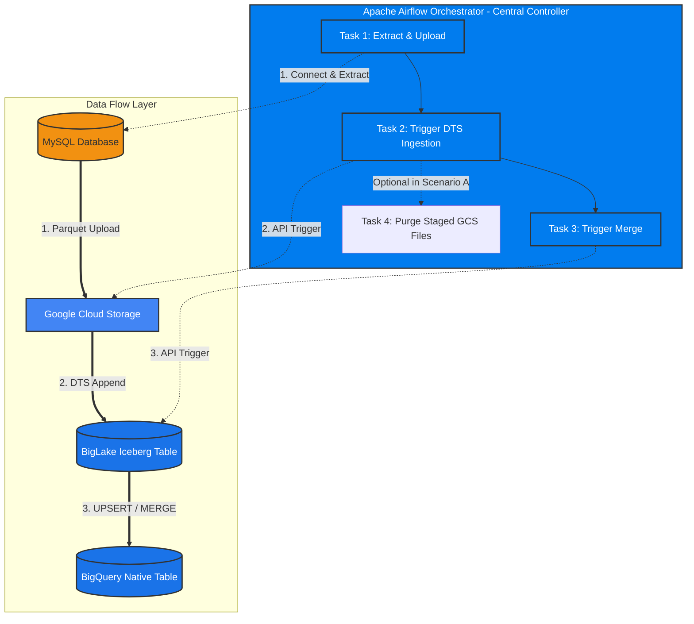

# Stage 3: Using DTS to Ingest into Iceberg
## Part 3.2: Airflow Orchestration with BigQuery DTS: Managing Staging Lifecycles (File Deletion vs. Retention) & Iceberg Storage

> **Section Overview & Orchestration Scenarios:**  
> This section brings together Apache Airflow, BigQuery Data Transfer Service (DTS), and BigLake Managed Tables. It demonstrates how Airflow coordinates data extraction from MySQL into GCS, triggers DTS on-demand via API, and manages downstream data consolidation into BigQuery native tables.
>
> In production Airflow pipelines, managing the intermediary GCS staging layer hinges on two distinct operational approaches:
> * **Scenario A (Post-Ingestion GCS File Deletion):** Airflow uploads Parquet batches to a temporary GCS prefix (`gs://bucket/landing_zone/*.parquet`), triggers DTS, and upon transfer completion executes an optional cleanup task (or relies on DTS's automatic deletion flag) to purge processed objects. This maintains an ephemeral landing zone with zero residual storage footprint.
> * **Scenario B (Filename & Prefix Detection Without Deletion):** Airflow uploads batches into structured, timestamped or date-prefixed GCS paths (e.g., `gs://bucket/landing_zone/export_YYYYMMDD/*.parquet`). Instead of deleting files, the orchestrator configures DTS to target the exact execution window's prefix. Historical files remain completely intact in GCS as an immutable lakehouse audit trail, and duplicate ingestion is prevented strictly by prefix/filename scoping.
>
> This guide demonstrates the baseline orchestration flow, explains Iceberg snapshot mechanics and Time Travel, and explores automated Google Cloud Garbage Collection.

---

## Standalone Code Assets
* **Airflow DAG:** [`dags/dag_07_dts_parquet_to_iceberg.py`](../../dags/dag_07_dts_parquet_to_iceberg.py)

---

## 1. Architecture & Dataflow Diagram



---

## 2. Component Roles & Orchestration Mechanics

### 2.1. Apache Airflow Tasks
1. **Extract & Transform (`PythonOperator`):** Dynamically checks if the BigQuery target table contains rows. If empty, it extracts all rows (Full Load); if populated, it extracts the last 24 hours of updates (Incremental Load). Converts to Parquet with `coerce_timestamps='us'` and uploads to GCS.
2. **Trigger Ingestion (`BigQueryDataTransferServiceStartTransferRunsOperator` [^1]):** Invokes the BigQuery DTS API to start a transfer run targeting the BigLake Iceberg table [^2].
3. **Trigger Merge (`BigQueryDataTransferServiceStartTransferRunsOperator` [^1]):** Invokes the Scheduled Query transfer run to execute the deduplicating `MERGE` query [^3].

> [!WARNING]
> **Important Orchestration Note on Asynchronous Execution:**  
> The `BigQueryDataTransferServiceStartTransferRunsOperator` starts the transfer run asynchronously and completes almost immediately (within 2–5 seconds) [^1][^2].  
> In this basic Stage 3 demo, tasks are chained sequentially:
> `task_extract_upload >> task_run_dts_parquet >> task_run_dts_merge`.  
> In production environments with larger data volumes, triggering the merge immediately can cause a race condition if DTS has not yet finished copying files.  
> **Recommended Solution:** Gate downstream tasks with `BigQueryDataTransferServiceTransferRunSensor` [^1], demonstrated in **Stage 4: [09_reference_pipeline_date_prefix_sensor.md](../04_incremental_loading/09_reference_pipeline_date_prefix_sensor.md)**.

---

## 3. BigQuery Configuration in GCP Console

Since Airflow manages the trigger timing via API, configure these transfers in BigQuery as **On-demand** (no internal cron schedule):

### 3.1. DTS Parquet Ingestion Config [^4]
1. In BigQuery Console, navigate to **Data transfers** > **Create Transfer**.
2. **Source:** Google Cloud Storage.
3. **Schedule:** `On-demand`.
4. **Destination table:** `dts_managed_users`.
5. **Cloud Storage URI:** `gs://<YOUR_BUCKET_NAME>/batch_landing_zone/*.parquet`.
6. **Write preference:** `APPEND`.
7. **File format:** `PARQUET`.

### 3.2. Scheduled Query Merge Config [^3]
Create a Scheduled Query set to `On-demand`:
```sql
MERGE `<YOUR_PROJECT_ID>.<YOUR_DATASET>.dts_native_users` T
USING (
  SELECT * EXCEPT(rn) 
  FROM (
    SELECT 
      *, 
      ROW_NUMBER() OVER(PARTITION BY id ORDER BY updated_at DESC) as rn
    FROM `<YOUR_PROJECT_ID>.<YOUR_DATASET>.dts_managed_users`
    WHERE updated_at >= TIMESTAMP(DATETIME_SUB(CURRENT_DATETIME('Asia/Jakarta'), INTERVAL 2 DAY))
  ) 
  WHERE rn = 1
) S 
ON T.id = S.id

WHEN MATCHED AND S.deleted_at IS NOT NULL THEN 
  DELETE
WHEN MATCHED AND S.deleted_at IS NULL THEN 
  UPDATE SET T.name = S.name, T.email = S.email, T.updated_at = S.updated_at
WHEN NOT MATCHED AND S.deleted_at IS NULL THEN 
  INSERT (id, name, email, created_at, updated_at, deleted_at) 
  VALUES (S.id, S.name, S.email, S.created_at, S.updated_at, S.deleted_at);
```

---

## 4. Iceberg DML Behavior & Storage Management

When modifying or deleting data in Iceberg tables, understanding how data is physically removed from Google Cloud Storage is critical.

### 4.1. How `DELETE` Works in Iceberg
* **Logical Deletion via Snapshots:** Executing `DELETE FROM dts_managed_users WHERE ...` produces a new Iceberg snapshot that excludes the deleted records [^5]. The records immediately disappear from standard queries.
* **Physical Storage:** The underlying `.parquet` files in GCS are **not deleted immediately**. This guarantees ACID isolation and powers Iceberg's **Time Travel** capabilities.

### 4.2. Garbage Collection & Automated Maintenance in BigLake
In self-managed open-source Iceberg (e.g. Spark/Flink on Dataproc), data engineers must schedule maintenance jobs to call `expireSnapshots` and remove orphaned files [^6].

With **BigLake Managed Tables (`table_format = 'ICEBERG'`)**, Google Cloud automates background maintenance [^7]:
1. **Retention Window (Time Travel):** BigQuery manages Iceberg snapshot retention using the dataset's **Time Travel Window** (default is 7 days, configurable between 2 to 7 days) [^7][^8].
2. **Automated Garbage Collection:** Once a snapshot exceeds the Time Travel window, BigQuery's automated maintenance engine deletes orphaned Parquet files and manifest lists from GCS, reducing physical storage consumption without requiring Spark or external cron jobs [^7].

---

## References

[^1]: [Apache Airflow - Google Cloud BigQuery DTS Operators](https://airflow.apache.org/docs/apache-airflow-providers-google/stable/operators/cloud/bigquery_dts.html)
[^2]: [Google Cloud - BigQuery Data Transfer Service API (startManualRuns)](https://cloud.google.com/bigquery/docs/reference/datatransfer/rest/v1/projects.locations.transferConfigs/startManualRuns)
[^3]: [Google Cloud - Scheduling queries in BigQuery](https://cloud.google.com/bigquery/docs/scheduling-queries)
[^4]: [Google Cloud - Cloud Storage transfer in BigQuery DTS](https://cloud.google.com/bigquery/docs/cloud-storage-transfer)
[^5]: [Apache Iceberg - Table Spec (Snapshots and Manifests)](https://iceberg.apache.org/docs/latest/spec/)
[^6]: [Apache Iceberg - Table Maintenance (Expire Snapshots)](https://iceberg.apache.org/docs/latest/maintenance/#expire-snapshots)
[^7]: [Google Cloud - Manage BigLake Iceberg tables (Automatic maintenance)](https://cloud.google.com/bigquery/docs/biglake-iceberg-tables-in-bigquery#automatic-maintenance)
[^8]: [Google Cloud - Data retention with time travel and fail-safe](https://cloud.google.com/bigquery/docs/time-travel)

---

## Next Steps:
To see how to handle dynamic full vs. incremental loads and date-partitioned GCS folders with sensors, proceed to **Stage 4: Incremental Loading**:  
**[../04_incremental_loading/08_dts_full_and_incremental_load.md](../04_incremental_loading/08_dts_full_and_incremental_load.md)**
