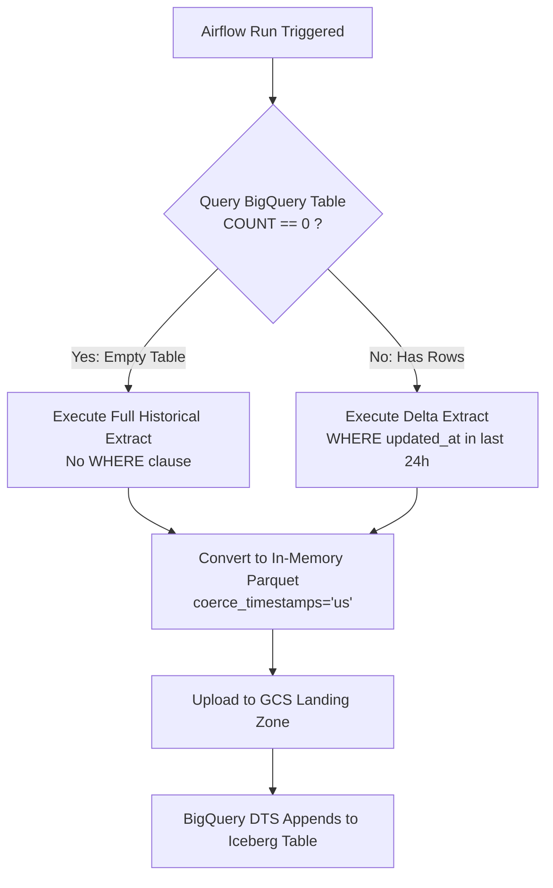

# Stage 4: Incremental Loading
## Part 4.1: Automated Full vs. Incremental Batch Ingestion

> **Section Overview:**  
> A resilient data pipeline must gracefully handle cold starts (initial full load of historical records) as well as day-to-day operations (incremental delta loads). This section details how Apache Airflow dynamically inspects the destination BigQuery table's row count to toggle between a full baseline extract and daily incremental slices, uploading them as Parquet files to GCS for DTS consumption.

---

## Standalone Code Assets
* **Airflow DAG:** [`dags/dag_08_dts_full_and_incremental.py`](../../dags/dag_08_dts_full_and_incremental.py)

---

## 1. Architectural Strategy: Dynamic Load Switching

Rather than maintaining two separate DAGs for initialization and daily runs:

1. **Target Inspection:** The DAG queries BigQuery:
   ```sql
   SELECT COUNT(1) FROM `<PROJECT>.<DATASET>.dts_managed_users`
   ```
2. **Dynamic Decision:**
   * **If count == 0:** Table is empty (cold start). The DAG extracts **all historical records** from MySQL without a time filter and writes `batch_users_full_load.parquet`.
   * **If count > 0:** Baseline exists. The DAG extracts only records where `updated_at` falls within the previous 24-hour execution window, naming the file `batch_users_incremental_YYYYMMDD.parquet`.
3. **Format Enforcement:** Timestamps are coerced to microsecond precision (`coerce_timestamps='us'`) before writing Parquet bytes to GCS.



---

## 2. BigQuery Table Schemas (DDL)

### 2.1. Staging: BigLake Managed Iceberg Table (History Layer)
```sql
CREATE OR REPLACE TABLE `<YOUR_PROJECT_ID>.<YOUR_DATASET>.dts_managed_users`
(
    id STRING,
    name STRING,
    email STRING,
    created_at TIMESTAMP,
    updated_at TIMESTAMP,
    deleted_at TIMESTAMP
)
PARTITION BY DATE(created_at) 
WITH CONNECTION `<YOUR_REGION>.<YOUR_CONNECTION_ID>`
OPTIONS (
    file_format = 'PARQUET', 
    table_format = 'ICEBERG', 
    storage_uri = 'gs://<YOUR_BUCKET_NAME>/batch_iceberg_managed/'
);
```

### 2.2. Serving: BigQuery Native Table (Main Layer)
```sql
CREATE OR REPLACE TABLE `<YOUR_PROJECT_ID>.<YOUR_DATASET>.dts_native_users`
(
    id STRING,
    name STRING,
    email STRING,
    created_at TIMESTAMP,
    updated_at TIMESTAMP,
    deleted_at TIMESTAMP
)
PARTITION BY DATE(created_at);
```

---

## 3. BigQuery DTS Ingestion Setup

1. In BigQuery Console, navigate to **Data transfers** > **Create Transfer**.
2. **Source:** Google Cloud Storage.
3. **Transfer config name:** `Batch_Ingest_Parquet_to_Iceberg`.
4. **Destination table:** `dts_managed_users`.
5. **Cloud Storage URI:** `gs://<YOUR_BUCKET_NAME>/batch_landing_zone/*.parquet`.
6. **Write preference:** `APPEND`.
7. **File format:** `PARQUET`.

---

## 4. Scaling Considerations for Production

> [!TIP]
> **Preventing Memory Spikes on Initial Full Load:**  
> When the destination table is empty and source relational tables have tens of millions of rows, loading the entire table into a single `pandas.DataFrame` in-memory can crash Airflow workers with Out-Of-Memory (OOM) errors.  
> In production:
> - Pass `chunksize=50000` to `pd.read_sql` to stream records.
> - Write chunks using `pyarrow.parquet.ParquetWriter` sequentially.
> - For very large tables (> 50 GB), consider Google Cloud Dataflow or Dataproc Serverless.

---

## Next Steps in Stage 4:
To implement the **canonical production-grade pattern** with date-partitioned GCS folders, Airflow Taskflow API, DTS sensors, and partition-pruned MERGE queries, proceed to:  
**[09_reference_pipeline_date_prefix_sensor.md](09_reference_pipeline_date_prefix_sensor.md)**
