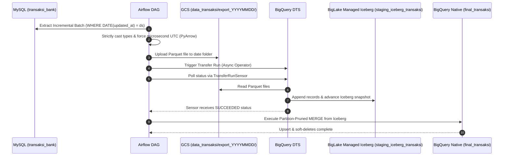

# Stage 4: Incremental Loading
## Part 4.2: Canonical Reference Pipeline: Immutable Date-Prefix Detection (Scenario B: Zero-Deletion) with DTS Sensor & Idempotent MERGE

> **Section Overview & Canonical Implementation of Scenario B:**  
> This is the **Canonical Reference Implementation** of the entire playbook. It provides the production-grade architectural blueprint for **Scenario B (Filename & Prefix Detection Without Deleting Files)**.
>
> In many enterprise data architectures, deleting raw source data after ingestion (Scenario A) violates data governance, compliance, and disaster recovery standards. This pipeline demonstrates how to achieve 100% duplicate-free ingestion while keeping **every historical Parquet file permanently archived in GCS**:
> 1. **Isolated Landing Prefixes:** Each execution batch lands in its own isolated date folder: `gs://<BUCKET>/data_transaksi/export_YYYYMMDD/data_*.parquet`.
> 2. **Dynamic DTS Scoping:** The BigQuery DTS transfer configuration is parameterized to target only the active execution date's folder prefix using runtime parameters (`export_{run_time|"%Y%m%d"}/`), completely eliminating the risk of re-ingesting past partitions.
> 3. **Zero Deletion:** Zero files are deleted from GCS. The data lake remains immutable, auditable, and replayable.
> 4. **Race-Condition Elimination:** A dedicated `BigQueryDataTransferServiceTransferRunSensor` polls DTS until terminal completion before downstream tasks fire.
> 5. **Idempotent MERGE:** An optimized BigQuery `MERGE` statement with partition pruning merges changes into the native serving layer.

---

## Standalone Code Assets
* **Airflow DAG:** [`dags/dag_09_reference_pipeline_date_prefix.py`](../../dags/dag_09_reference_pipeline_date_prefix.py)
* **Table DDLs:** [`sql/04_ddl_reference_staging_and_native.sql`](../../sql/04_ddl_reference_staging_and_native.sql)
* **Templated MERGE Query:** [`sql/05_merge_staging_to_native.sql`](../../sql/05_merge_staging_to_native.sql)

---

## 1. Architectural Blueprint (Scenario B: Immutable Retention)



---

## 2. Infrastructure Setup (DDL)

Run these DDLs in BigQuery Studio to create the staging and serving tables:

### 2.1. Staging Table (BigLake Managed Iceberg)
```sql
CREATE TABLE IF NOT EXISTS `<YOUR_PROJECT_ID>.<YOUR_DATASET_ID>.staging_iceberg_transaksi`
(
    id_transaksi STRING,
    jumlah FLOAT64,
    status STRING,
    tanggal_transaksi DATE,
    created_at TIMESTAMP,
    updated_at TIMESTAMP,
    deleted_at TIMESTAMP
)
WITH CONNECTION `<YOUR_REGION>.<YOUR_CONNECTION_NAME>`
OPTIONS (
    file_format = 'PARQUET',
    table_format = 'ICEBERG',
    storage_uri = 'gs://<YOUR_GCS_BUCKET>/iceberg_staging_transaksi/'
);
```

### 2.2. Production Serving Table (BigQuery Native)
Partitioned by `created_at` and clustered by `id_transaksi` for optimal point-lookups:
```sql
CREATE TABLE IF NOT EXISTS `<YOUR_PROJECT_ID>.<YOUR_DATASET_ID>.final_transaksi`
(
    id_transaksi STRING,
    jumlah FLOAT64,
    status STRING,
    tanggal_transaksi DATE,
    created_at TIMESTAMP,
    updated_at TIMESTAMP,
    deleted_at TIMESTAMP
)
PARTITION BY DATE(created_at)
CLUSTER BY id_transaksi;
```

### 2.3. MySQL Table Creation
```SQL
CREATE TABLE IF NOT EXISTS final_transaksi (
    id_transaksi VARCHAR(50) PRIMARY KEY,
    jumlah DOUBLE, 
    status VARCHAR(50),
    tanggal_transaksi DATE,
    created_at DATETIME NOT NULL,
    updated_at DATETIME NOT NULL,
    deleted_at DATETIME NULL
);
```
---

## 3. BigQuery DTS Configuration with Timezone Macro

To ensure DTS only ingests files from the specific run's date subfolder without scanning previous runs:

1. In BigQuery Console, navigate to **Data transfers** > **Create Transfer**.
2. **Source Type:** Google Cloud Storage.
3. **Transfer Config Name:** `DTS_GCS_to_Iceberg`.
4. **Schedule:** `On-demand` (Airflow triggers and monitors this).
5. **Destination Dataset:** `<YOUR_DATASET_ID>`.
6. **Destination Table:** `staging_iceberg_transaksi`.
7. **Cloud Storage URI:**  
   `gs://<YOUR_GCS_BUCKET>/data_transaksi/export_{run_time+7h|"%Y%m%d"}/*.parquet`
   > [!TIP]
   > The `{run_time+7h}` macro dynamically offsets UTC execution time to GMT+7 (Asia/Jakarta), aligning the DTS pattern matching with Airflow's localized date directory.
8. **File Format:** `PARQUET`.
9. Click **Save** and note the generated **Configuration ID** (e.g. `6aa9c338-xxxx-xxxx-xxxx-xxxxxxxxxxxx`).

---

## 4. Key Engineering Wins in this Pipeline

### A. Eliminating Race Conditions via DTS Sensor
Earlier stages triggered DTS asynchronously and immediately started the MERGE query. In this reference pipeline, we use `BigQueryDataTransferServiceTransferRunSensor`:

```python
trigger_dts = BigQueryDataTransferServiceStartTransferRunsOperator(
    task_id="trigger_dts",
    project_id=PROJECT_ID,
    transfer_config_id=DTS_CONFIG_ID,
    location=REGION,
    requested_run_time={"seconds": "{{ data_interval_end.int_timestamp }}"},
    gcp_conn_id=GCP_CONN_ID,
)

wait_for_dts = BigQueryDataTransferServiceTransferRunSensor(
    task_id="wait_for_dts",
    project_id=PROJECT_ID,
    transfer_config_id=DTS_CONFIG_ID,
    location=REGION,
    run_id="{{ task_instance.xcom_pull(task_ids='trigger_dts', key='return_value').name.split('/')[-1] }}",
    expected_statuses={"SUCCEEDED"},
    poke_interval=30,
    timeout=1200,
    gcp_conn_id=GCP_CONN_ID,
)

trigger_dts >> wait_for_dts >> upsert_to_final
```

### B. Strict PyArrow Schema Typing
Avoids BigQuery `INVALID_ARGUMENT` precision errors by enforcing:
- `pa.date32()`: Prevents date objects from being converted to strings.
- `pa.timestamp('us', tz='UTC')`: Guarantees UTC microsecond timestamps.

### C. Partition-Pruned Idempotent MERGE
Uses `QUALIFY ROW_NUMBER() OVER(PARTITION BY id_transaksi ORDER BY updated_at DESC) = 1` to eliminate duplicate mutated records within the batch window, and enforces partition pruning in the `ON` clause to keep query scanning costs minimal.

---

## Next Steps:
To tackle schema drift (adding columns dynamically without breaking DTS or Iceberg), proceed to **Stage 5: Schema Evolution Workaround**:  
**[../05_schema_evolution/10_automated_schema_evolution_iceberg.md](../05_schema_evolution/10_automated_schema_evolution_iceberg.md)**
