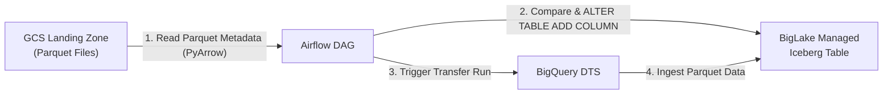

# Stage 5: Schema Evolution Workaround
## Part 5.1: Automated Schema Drift Detection & Evolution for BigLake Iceberg

> **Section Overview:**  
> In real-world data pipelines, upstream database schemas change: new columns are added over time. While BigQuery Native tables support `schema_update_options = ['ALLOW_FIELD_ADDITION']` <a href="https://cloud.google.com/bigquery/docs/managing-table-schemas" target="_blank">[1]</a>, BigQuery DTS and standard Load APIs **do not currently support automated schema evolution for BigLake Managed Apache Iceberg tables** <a href="https://cloud.google.com/bigquery/docs/biglake-iceberg-tables-in-bigquery#limitations" target="_blank">[2]</a>. Attempting to load files with new columns causes DTS to abort with a schema mismatch error. In contrast, Apache Iceberg's specification fully supports schema evolution without rewriting existing data files <a href="https://iceberg.apache.org/docs/latest/evolution/#schema-evolution" target="_blank">[3]</a>.  
> This section presents an automated hybrid workaround: an Airflow pre-load task inspects incoming Parquet metadata in GCS via PyArrow <a href="https://arrow.apache.org/docs/python/parquet.html" target="_blank">[4]</a>, applies `ALTER TABLE ... ADD COLUMN IF NOT EXISTS` dynamically <a href="https://cloud.google.com/bigquery/docs/reference/standard-sql/data-definition-language#alter_table_add_column_statement" target="_blank">[5]</a>, and only then triggers DTS to ingest the data without errors.

---

## Standalone Code Assets
* **Synthetic Data Producer:** [`scripts/simulate_mysql_producer.py`](../../scripts/simulate_mysql_producer.py)
* **Airflow Schema Evolution DAG:** [`dags/dag_10_schema_evolution_iceberg.py`](../../dags/dag_10_schema_evolution_iceberg.py)

---

## 1. Architecture: Dynamic Schema Synchronization



### The Two-Task Workflow:
1. **Task 1 (`check_and_evolve_schema`)**:
   - Inspects the incoming Parquet file metadata directly in GCS using `pyarrow.parquet.read_schema` <a href="https://arrow.apache.org/docs/python/parquet.html" target="_blank">[4]</a>.
   - Fetches the current schema of the destination BigQuery Iceberg table using `BigQueryHook`.
   - Computes set differences (`new_cols = parquet_cols - bq_cols`).
   - Translates PyArrow physical data types (`int64`, `timestamp[us]`, `date32`, etc.) to BigQuery SQL types.
   - Executes `ALTER TABLE <table_id> ADD COLUMN IF NOT EXISTS <col> <type>` <a href="https://cloud.google.com/bigquery/docs/reference/standard-sql/data-definition-language#alter_table_add_column_statement" target="_blank">[5]</a>.
2. **Task 2 (`trigger_dts_transfer`)**:
   - Triggers the on-demand BigQuery Data Transfer Service (DTS) transfer run <a href="https://cloud.google.com/bigquery/docs/cloud-storage-transfer" target="_blank">[8]</a>. Because the table schema has already been pre-expanded to match the Parquet file, DTS ingests the records smoothly without rejection.

---

## 2. Prerequisites & IAM Setup

### Connection Delegation Permission
When BigQuery queries external tables or modifies Iceberg storage using a BigLake Connection, the executing principal requires connection delegation rights.

If your Airflow task fails with:
```text
google.api_core.exceptions.Forbidden: 403 Access Denied: User does not have bigquery.connections.delegate permission...
```

**Resolution:**
1. Open the **BigQuery Console**.
2. Locate your connection under **External connections** (e.g., `<LOCATION>.<CONNECTION_NAME>`).
3. Click **Share Connection** / **Edit Permissions**.
4. Add the Service Account used by Airflow (e.g., `<AIRFLOW_SA>@<PROJECT_ID>.iam.gserviceaccount.com`).
5. Assign the **BigQuery Connection User** (`roles/bigquery.connectionUser`) role <a href="https://cloud.google.com/bigquery/docs/create-cloud-storage-table-biglake#grant-connection-access" target="_blank">[6]</a>.

---

## 3. Destination BigQuery Iceberg Table Setup

Initialize your managed Iceberg table in BigQuery with its initial schema <a href="https://cloud.google.com/bigquery/docs/biglake-iceberg-tables-in-bigquery#create-tables" target="_blank">[7]</a>:

```sql
CREATE SCHEMA IF NOT EXISTS `<YOUR_PROJECT_ID>.<YOUR_DATASET_ID>` 
OPTIONS (location = '<YOUR_LOCATION>');

CREATE OR REPLACE TABLE `<YOUR_PROJECT_ID>.<YOUR_DATASET_ID>.<YOUR_TABLE_NAME>` (
    order_id INT64,
    customer_id INT64,
    status STRING
)
WITH CONNECTION `<YOUR_LOCATION>.<YOUR_CONNECTION_NAME>`
OPTIONS (
    file_format = 'PARQUET',
    table_format = 'ICEBERG',
    storage_uri = 'gs://<YOUR_BUCKET_NAME>/<YOUR_ICEBERG_STORAGE_PREFIX>/'
);
```

---

## 4. BigQuery Data Transfer Service (DTS) Setup

Configure the DTS transfer via Console <a href="https://cloud.google.com/bigquery/docs/cloud-storage-transfer" target="_blank">[8]</a>:

1. Go to **BigQuery > Data Transfers > Create Transfer**.
2. **Source**: Google Cloud Storage.
3. **Cloud Storage URI**: `gs://<YOUR_BUCKET_NAME>/<YOUR_GCS_PREFIX>/*.parquet`.
4. **Destination Dataset**: `<YOUR_DATASET_ID>`.
5. **Destination Table**: `<YOUR_TABLE_NAME>`.
6. **File Format**: `PARQUET`.
7. **Write Preference**: `APPEND`.
8. **Schedule**: `On-demand` (Airflow triggers this after schema synchronization).
9. Copy the generated **Transfer Config ID** for the Airflow DAG.

---

## 5. Simulating Schema Evolution & Testing

### Step 1: Run the Synthetic Producer Script
Run [`scripts/simulate_mysql_producer.py`](../../scripts/simulate_mysql_producer.py) locally or in Cloud Shell:
```bash
python scripts/simulate_mysql_producer.py --day 2 --bucket <YOUR_BUCKET_NAME> --prefix <YOUR_GCS_PREFIX>/
```
This uploads a Parquet file containing newly introduced columns (`order_date`, `created_at`, `item_count`, and `discount_amount`).

### Step 2: Trigger the Airflow DAG
In the Airflow UI, trigger `gcs_parquet_to_iceberg_dts_orchestration`.

### Step 3: Review Airflow Execution Logs
Check the logs for `check_and_evolve_schema`:
```text
[SCHEMA EVOLUTION] New column detected: 'order_date' (date32[day]) -> BQ Type: 'DATE'
[SCHEMA EVOLUTION] New column detected: 'created_at' (timestamp[us]) -> BQ Type: 'TIMESTAMP'
[SCHEMA EVOLUTION] New column detected: 'item_count' (int64) -> BQ Type: 'INT64'
[SCHEMA EVOLUTION] New column detected: 'discount_amount' (double) -> BQ Type: 'FLOAT64'
Successfully executed DDL: ALTER TABLE `project.dataset.table` ADD COLUMN IF NOT EXISTS `order_date` DATE, ADD COLUMN IF NOT EXISTS `created_at` TIMESTAMP, ...
```

### Step 4: Verify in BigQuery Studio
Inspect the Iceberg table in BigQuery Studio:
```sql
SELECT * FROM `<YOUR_PROJECT_ID>.<YOUR_DATASET_ID>.<YOUR_TABLE_NAME>` LIMIT 10;
```
All new columns are present and correctly populated!

---

## Conclusion of Stage 5
This concludes the 5-stage progression from conceptual foundations to enterprise-grade automated schema evolution. For an overview and roadmap of the complete playbook, return to the **[Master README](../../README.md)**.

---

## References

1. <a href="https://cloud.google.com/bigquery/docs/managing-table-schemas" target="_blank">Google Cloud - Modifying table schemas in BigQuery (ALLOW_FIELD_ADDITION)</a>
2. <a href="https://cloud.google.com/bigquery/docs/biglake-iceberg-tables-in-bigquery#limitations" target="_blank">Google Cloud - BigLake Iceberg table limitations</a>
3. <a href="https://iceberg.apache.org/docs/latest/evolution/#schema-evolution" target="_blank">Apache Iceberg - Schema Evolution Specification</a>
4. <a href="https://arrow.apache.org/docs/python/parquet.html" target="_blank">Apache Arrow - Reading and Writing the Apache Parquet Format</a>
5. <a href="https://cloud.google.com/bigquery/docs/reference/standard-sql/data-definition-language#alter_table_add_column_statement" target="_blank">Google Cloud - BigQuery ALTER TABLE ADD COLUMN statement</a>
6. <a href="https://cloud.google.com/bigquery/docs/create-cloud-storage-table-biglake#grant-connection-access" target="_blank">Google Cloud - BigLake IAM permissions (Grant connection user access)</a>
7. <a href="https://cloud.google.com/bigquery/docs/biglake-iceberg-tables-in-bigquery#create-tables" target="_blank">Google Cloud - Manage BigLake Iceberg tables (Create tables)</a>
8. <a href="https://cloud.google.com/bigquery/docs/cloud-storage-transfer" target="_blank">Google Cloud - Cloud Storage transfer in BigQuery DTS</a>
