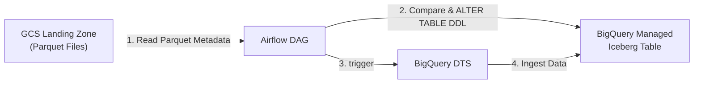

# Automated Schema Evolution for GCS to BigQuery Iceberg Managed Tables

This repository provides a step-by-step guide and code implementation for building an automated data pipeline using **Apache Airflow** and **BigQuery Data Transfer Service (DTS)**.

Because BigQuery Load Jobs and DTS **do not** natively support auto-schema evolution (`ALLOW_FIELD_ADDITION`) for **Apache Iceberg Managed Tables**, this hybrid architecture leverages Airflow to dynamically detect new columns in GCS Parquet files, map their data types, execute the necessary DDL (`ALTER TABLE`), and trigger DTS to ingest the data safely.

---

## Architecture Overview



- **Airflow Task 1 (`check_and_evolve_schema`)**: Reads the incoming Parquet file metadata directly from GCS using `pyarrow`, compares it against the destination BigQuery Iceberg schema, translates data types, and runs `ALTER TABLE ... ADD COLUMN` if new fields are detected.
- **Airflow Task 2 (`trigger_dts_transfer`)**: Executes the pre-configured BigQuery Data Transfer Service (DTS) job on-demand to move the Parquet data into the Iceberg table.

---

## Prerequisites & IAM Setup

### BigQuery Connection & IAM Permission Resolution

When BigQuery queries external tables or Iceberg storage using a BigLake Connection, the executing principal requires connection delegation rights.

If your Airflow task fails with the following error:

```text
google.api_core.exceptions.Forbidden: 403 Access Denied: User does not have bigquery.connections.delegate permission...
```
d
**Resolution:**

1. Open the Google Cloud Console and navigate to BigQuery.
2. Expand your project and locate your connection under **Connections** (e.g., `<YOUR_LOCATION>.<YOUR_CONNECTION_NAME>`).
3. Click **Share Connection** (or **Permissions**) on the connection details pane.
4. Add the IAM Service Account used by your Airflow environment (e.g., `<YOUR_AIRFLOW_SERVICE_ACCOUNT_EMAIL>`).
5. Assign the **BigQuery Connection User** (`roles/bigquery.connectionUser`) role.

---

## Step 1: Destination BigQuery Iceberg Table Setup

Create your managed Apache Iceberg table in BigQuery. Ensure it points to your BigLake connection and an underlying GCS storage URI.

```sql
CREATE SCHEMA IF NOT EXISTS `<YOUR_PROJECT_ID>.<YOUR_DATASET_ID>` 
OPTIONS (location = '<YOUR_LOCATION>');

CREATE OR REPLACE TABLE `<YOUR_PROJECT_ID>.<YOUR_DATASET_ID>.<YOUR_TABLE_NAME>` (
    order_id INT64,
    customer_id INT64,
    status STRING
)
WITH CONNECTION `<YOUR_LOCATION>.<YOUR_CONNECTION_NAME>`
OPTIONS (
    file_format = 'PARQUET',
    table_format = 'ICEBERG',
    storage_uri = 'gs://<YOUR_BUCKET_NAME>/<YOUR_ICEBERG_STORAGE_PREFIX>'
);
```

---

## Step 2: BigQuery Data Transfer Service (DTS) Setup

Create a DTS transfer job targeting your Iceberg table:

1. Go to **BigQuery > Data Transfers > Create Transfer**.
2. **Source**: Google Cloud Storage.
3. **Cloud Storage URI**: `gs://<YOUR_BUCKET_NAME>/<YOUR_GCS_PREFIX>/*.parquet`.
4. **Destination Dataset**: `<YOUR_DATASET_ID>`.
5. **Destination Table**: `<YOUR_TABLE_NAME>`.
6. **File Format**: PARQUET.
7. **Write Preference**: APPEND.
8. **Schedule**: Select **On-demand / Manual** (or disable the automatic schedule). Airflow will trigger this job after confirming the schema match.
9. Note down the **Transfer Config ID** from the URL after saving (e.g., `6aaa2142-0000-2f1f-b86a-34c7e918f963`).

---

## Step 3: Source Data Producer (Python Script)

Use the following script to create Parquet files containing new columns with specific Python/Pandas data types (e.g., `DATE`, `TIMESTAMP`, `INT64`).

```python
import os
import pandas as pd
from datetime import date, datetime
from google.cloud import storage

# Configuration
BUCKET_NAME = "<YOUR_BUCKET_NAME>"
FILE_NAME = "sample_data.parquet"
GCS_DESTINATION_PATH = f"<YOUR_GCS_PREFIX>/{FILE_NAME}"

# Mock data containing new columns with explicit data types
data = [
    {
        "order_id": 101,
        "customer_id": 501,
        "status": "completed",
        # New Column 1: DATE type
        "order_date": date(2026, 9, 16),
        # New Column 2: TIMESTAMP type
        "created_at": datetime(2026, 9, 16, 14, 30, 0),
        # New Column 3: INT64 type
        "item_count": 3
    }
]

# Create DataFrame
df = pd.DataFrame(data)

# Ensure explicit datetime casting to avoid falling back to string types
df['order_date'] = pd.to_datetime(df['order_date']).dt.date
df['created_at'] = pd.to_datetime(df['created_at'])

# Save to local Parquet and upload to GCS
df.to_parquet(FILE_NAME, engine="pyarrow", index=False)

client = storage.Client(project="<YOUR_PROJECT_ID>")
bucket = client.bucket(BUCKET_NAME)
blob = bucket.blob(GCS_DESTINATION_PATH)
blob.upload_from_filename(FILE_NAME)

print(f"Uploaded gs://{BUCKET_NAME}/{GCS_DESTINATION_PATH}")
os.remove(FILE_NAME)
```

---

## Step 4: Airflow DAG Implementation

Save this DAG file as `gcs_parquet_to_iceberg_dts.py` inside your Airflow `dags/` directory.

```python
from datetime import datetime, timezone
from airflow import DAG
from airflow.decorators import task
from airflow.providers.google.cloud.hooks.bigquery import BigQueryHook
from airflow.providers.google.cloud.operators.bigquery_dts import BigQueryDataTransferServiceStartTransferRunsOperator
import pyarrow as pa
import pyarrow.parquet as pq
import pyarrow.types as types
import gcsfs

default_args = {
    'owner': 'airflow',
    'start_date': datetime(2023, 1, 1),
}

with DAG(
    'gcs_parquet_to_iceberg_dts_orchestration',
    default_args=default_args,
    schedule_interval=None,
    catchup=False,
) as dag:
    
    @task
    def check_and_evolve_schema(bucket: str, prefix: str, project_id: str, dataset_id: str, table_id: str):
        """
        Reads GCS Parquet metadata, compares schema against BigQuery Iceberg table,
        and dynamically alters the BigQuery table schema if new columns exist.
        """
        
        def map_pyarrow_to_bq_type(pa_type) -> str:
            """Maps PyArrow data types to BigQuery SQL data types."""
            if types.is_string(pa_type) or types.is_large_string(pa_type):
                return "STRING"
            elif types.is_integer(pa_type):
                return "INT64"
            elif types.is_floating(pa_type):
                return "FLOAT64"
            elif types.is_boolean(pa_type):
                return "BOOL"
            elif types.is_timestamp(pa_type):
                return "TIMESTAMP"
            elif types.is_date(pa_type):
                return "DATE"
            elif types.is_decimal(pa_type):
                return "NUMERIC"
            else:
                return "STRING"  # Fallback type

        # 1. Inspect PyArrow schema from GCS landing zone
        fs = gcsfs.GCSFileSystem()
        files = fs.glob(f"gs://{bucket}/{prefix}*.parquet")
        if not files:
            print("No files found in landing zone.")
            return
            
        parquet_schema = pq.read_schema(f"gs://{files[0]}")
        parquet_cols = set(parquet_schema.names)
        
        # 2. Inspect current BigQuery Iceberg schema
        bq_hook = BigQueryHook(gcp_conn_id='google_cloud_default')
        client = bq_hook.get_client(project_id=project_id)
        table_ref = client.get_table(f"{project_id}.{dataset_id}.{table_id}")
        bq_cols = {field.name for field in table_ref.schema}
        
        # 3. Compute schema difference and construct DDL
        new_cols = parquet_cols - bq_cols
        if new_cols:
            alter_statements = []
            for col in new_cols:
                pa_type = parquet_schema.field(col).type
                bq_type = map_pyarrow_to_bq_type(pa_type)
                print(f"[SCHEMA EVOLUTION] New column detected: '{col}' ({pa_type}) -> BQ Type: '{bq_type}'")
                alter_statements.append(f"ADD COLUMN {col} {bq_type}")
                
            query = f"ALTER TABLE `{project_id}.{dataset_id}.{table_id}` {', '.join(alter_statements)}"
            
            # Execute DDL query
            client.query_and_wait(query)
            print(f"Successfully executed DDL: {query}")
        else:
            print("No schema changes detected.")

    # Task 1: Check schema & alter table
    schema_task = check_and_evolve_schema(
        bucket='<YOUR_BUCKET_NAME>', 
        prefix='<YOUR_GCS_PREFIX>/',
        project_id='<YOUR_PROJECT_ID>',
        dataset_id='<YOUR_DATASET_ID>',
        table_id='<YOUR_TABLE_NAME>'
    )

    # Task 2: Trigger BigQuery Data Transfer Service
    trigger_dts = BigQueryDataTransferServiceStartTransferRunsOperator(
        task_id="trigger_dts_transfer",
        project_id='<YOUR_PROJECT_ID>',
        transfer_config_id="<YOUR_DTS_TRANSFER_CONFIG_ID>", 
        location='<YOUR_LOCATION>',
        requested_run_time={"seconds": int(datetime.now(timezone.utc).timestamp())},
    )

    # Execution Flow
    schema_task >> trigger_dts
```

---

## Step 5: Verification & Testing Workflow

1. **Upload Test File**: Run the Python data producer script to push a `.parquet` file with new columns into GCS.
2. **Trigger DAG**: In the Airflow UI, trigger `gcs_parquet_to_iceberg_dts_orchestration`.
3. **Review Task Logs**: Check logs for the `check_and_evolve_schema` task. You should see outputs like:

```text
[SCHEMA EVOLUTION] New column detected: 'order_date' (date32[day]) -> BQ Type: 'DATE'
[SCHEMA EVOLUTION] New column detected: 'created_at' (timestamp[us]) -> BQ Type: 'TIMESTAMP'
[SCHEMA EVOLUTION] New column detected: 'item_count' (int64) -> BQ Type: 'INT64'
Successfully executed DDL: ALTER TABLE `<YOUR_PROJECT_ID>.<YOUR_DATASET_ID>.<YOUR_TABLE_NAME>` ADD COLUMN order_date DATE, ADD COLUMN created_at TIMESTAMP, ADD COLUMN item_count INT64
```

4. **Query BigQuery**: Run `SELECT * FROM <YOUR_PROJECT_ID>.<YOUR_DATASET_ID>.<YOUR_TABLE_NAME>` in BigQuery. Verify that the table schema updated with native data types and all records were ingested seamlessly by DTS.