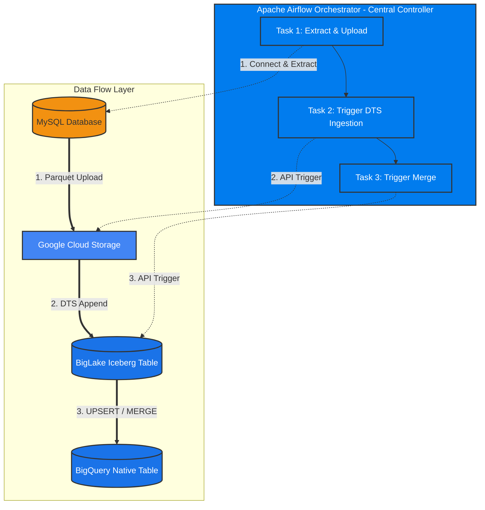

# Modern Data Lakehouse: Batch Data Migration via GCS Parquet and BigQuery DTS

## 1. Architecture & Dataflow Diagram

This pipeline implements a fully orchestrated batch architecture. **Apache Airflow acts as the central orchestrator**, executing a single DAG that sequentially extracts data, triggers the BigQuery Data Transfer Service (DTS) for ingestion, and triggers a Scheduled Query for the final merge[cite: 3].



## 2. Component Roles & Functions

### 2.1. Apache Airflow (The Central Orchestrator)
Airflow handles the end-to-end execution of the pipeline using three sequential tasks:
1.  **Extract & Transform (`PythonOperator`):** Dynamically checks if the BigQuery target table is empty to decide whether to run a Full Load (no `WHERE` clause) or an Incremental Load. It extracts data from MySQL, converts it to Parquet in-memory (`BytesIO`) while coercing timestamps to microseconds (`coerce_timestamps='us'`), and uploads it to GCS[cite: 3].
2.  **Trigger Ingestion (`BigQueryDataTransferServiceStartTransferRunsOperator`):** Calls the BigQuery DTS API to immediately ingest the newly uploaded Parquet file into the BigLake Managed Table.
3.  **Trigger Merge (`BigQueryDataTransferServiceStartTransferRunsOperator`):** Calls the BigQuery API to execute the Scheduled Query containing the `MERGE` logic, pushing data from the Managed Table to the Native Table.

### 2.2. BigQuery DTS (Ingestion Engine)
*   Managed entirely by Airflow triggers (no internal cron schedule needed).
*   Appends the Parquet data into the History Layer (BigLake Managed Table) and updates the Iceberg metadata[cite: 3].

### 2.3. BigQuery Scheduled Query (Merge Engine)
*   Managed by Airflow triggers.
*   **Deduplication:** Uses `ROW_NUMBER() OVER(PARTITION BY id ORDER BY updated_at DESC)` to isolate the most recent record[cite: 3].
*   **DML Operations:** Executes `INSERT` for new records, `UPDATE` for changed records, and `DELETE` for soft-deleted records into the Main Layer[cite: 3].

---

## 3. Prerequisites & GCP Setup

1.  **BigLake Connection:** Create an external data connection in BigQuery (e.g., `<your-region>.<your-connection-id>`)[cite: 3].
2.  **Cloud Storage Bucket:** Create a bucket with two distinct folders[cite: 3]:
    *   `gs://<your-bucket-name>/batch_landing_zone/` (For raw Parquet drops)
    *   `gs://<your-bucket-name>/batch_iceberg_managed/` (For BigLake Iceberg metadata/storage)

---

## 4. BigQuery Table Schemas (DDL)

### Target 1: BigLake Managed Iceberg Table (History Layer)

```sql
CREATE OR REPLACE TABLE `<your-project-id>.<your-dataset>.dts_managed_users`
(
    id STRING,
    name STRING,
    email STRING,
    created_at TIMESTAMP,
    updated_at TIMESTAMP,
    deleted_at TIMESTAMP
)
PARTITION BY DATE(created_at) 
WITH CONNECTION `<your-project-id>.<your-region>.<your-connection-id>`
OPTIONS (
    file_format = 'PARQUET', 
    table_format = 'ICEBERG', 
    storage_uri = 'gs://<your-bucket-name>/batch_iceberg_managed/'
);
```

### Target 2: BigQuery Native Table (Main Layer)

```sql
CREATE OR REPLACE TABLE `<your-project-id>.<your-dataset>.dts_native_users`
(
    id STRING,
    name STRING,
    email STRING,
    created_at TIMESTAMP,
    updated_at TIMESTAMP,
    deleted_at TIMESTAMP
)
PARTITION BY DATE(created_at);
```

---

## 5. Apache Airflow Orchestration (The Unified DAG)

This DAG contains the complete 3-step workflow. Make sure to retrieve the correct `transferConfigs` resource names from your GCP Console for the operators.

### Airflow DAG Code (`mysql_to_gcs_parquet_dts_unified.py`)

```python
from datetime import timedelta
import pendulum
import pandas as pd
from io import BytesIO
from airflow import DAG
from airflow.operators.python import PythonOperator
from airflow.providers.mysql.hooks.mysql import MySqlHook
from airflow.providers.google.cloud.hooks.gcs import GCSHook
from airflow.providers.google.cloud.hooks.bigquery import BigQueryHook
from airflow.providers.google.cloud.operators.bigquery_dts import BigQueryDataTransferServiceStartTransferRunsOperator

# --- CONFIGURATION ---
PROJECT_ID = 'imposing-league-374504'
GCS_BUCKET = 'biglake_data'
GCS_LANDING_FOLDER = 'batch_landing_zone/'
BQ_DATASET_ID = '<your-dataset>'
BQ_MANAGED_TABLE = 'dts_managed_users'

# Format resource name DTS config milikmu (ambil dari GCP Console / gcloud)
DTS_PARQUET_CONFIG_NAME = 'projects/imposing-league-374504/locations/us/transferConfigs/<your-parquet-transfer-config-id>'
DTS_MERGE_CONFIG_NAME = 'projects/imposing-league-374504/locations/us/transferConfigs/<your-merge-scheduled-query-config-id>'

jkt_tz = pendulum.timezone("Asia/Jakarta")

default_args = {
    'owner': 'data_engineer',
    'depends_on_past': False,
    'retries': 1,
    'retry_delay': timedelta(minutes=3),
}

with DAG(
    'mysql_to_bq_lakehouse_unified',
    default_args=default_args,
    schedule_interval='0 0 * * *', # Daily
    start_date=pendulum.datetime(2026, 8, 25, tz="Asia/Jakarta"),
    catchup=False,
    tags=['batch', 'mysql', 'gcs', 'iceberg', 'dts'],
) as dag:

    def mysql_to_parquet_gcs(**kwargs):
        execution_date = kwargs.get('data_interval_end').in_timezone(jkt_tz)
        yesterday = execution_date.subtract(days=1)
        
        start_win = yesterday.start_of('day').to_datetime_string() 
        end_win = yesterday.end_of('day').to_datetime_string()     
        
        # 1. Check Target Table Status in BigQuery (Full or Incremental)
        bq_hook = BigQueryHook(gcp_conn_id='google_cloud_default', use_legacy_sql=False)
        check_query = f"SELECT COUNT(1) FROM `{PROJECT_ID}.{BQ_DATASET_ID}.{BQ_MANAGED_TABLE}`"
        
        is_empty = True
        try:
            records = bq_hook.get_records(check_query)
            if records and records[0][0] > 0:
                is_empty = False
                print(f"Table contains {records[0][0]} rows. Proceeding with Incremental Load.")
            else:
                print("Table is empty. Proceeding with Full Load.")
        except Exception as e:
             print(f"Table check failed: {e}. Proceeding with Full Load.")
             is_empty = True

        # 2. Construct dynamic SQL Query
        if is_empty:
            query = "SELECT id, name, email, created_at, updated_at, deleted_at FROM users"
            filename_suffix = "full_load"
        else:
            query = f"SELECT id, name, email, created_at, updated_at, deleted_at FROM users WHERE updated_at >= '{start_win}' AND updated_at <= '{end_win}'"
            filename_suffix = yesterday.strftime('%Y%m%d')

        print(f"Executing Query: {query}")

        mysql_hook = MySqlHook(mysql_conn_id='mysql_default')
        engine = mysql_hook.get_sqlalchemy_engine()
        df = pd.read_sql(query, engine)
        
        if df.empty:
            print("No data found. Skipping.")
            return "skipped"
            
        for col in ['created_at', 'updated_at', 'deleted_at']:
            df[col] = pd.to_datetime(df[col], errors='coerce')
            
        # 3. In-memory Parquet conversion
        parquet_buffer = BytesIO()
        df.to_parquet(
            parquet_buffer, 
            engine='pyarrow', 
            index=False,
            coerce_timestamps='us',          
            allow_truncated_timestamps=True 
        )
        
        # 4. Upload to GCS
        filename = f"{GCS_LANDING_FOLDER}batch_users_{filename_suffix}.parquet"
        gcs_hook = GCSHook(gcp_conn_id='google_cloud_default')
        gcs_hook.upload(
            bucket_name=GCS_BUCKET,
            object_name=filename,
            data=parquet_buffer.getvalue(),
            mime_type='application/octet-stream'
        )

    # TASK 1: Generate & Upload Parquet
    task_extract_upload = PythonOperator(
        task_id='extract_and_upload_parquet',
        python_callable=mysql_to_parquet_gcs,
    )

    # TASK 2: Trigger DTS for Parquet Ingestion
    task_run_dts_parquet = BigQueryDataTransferServiceStartTransferRunsOperator(
        task_id='run_dts_parquet_to_managed_table',
        transfer_config_name=DTS_PARQUET_CONFIG_NAME,
        gcp_conn_id='google_cloud_default',
    )

    # TASK 3: Trigger DTS Scheduled Query for Merging
    task_run_dts_merge = BigQueryDataTransferServiceStartTransferRunsOperator(
        task_id='run_dts_scheduled_query_merge',
        transfer_config_name=DTS_MERGE_CONFIG_NAME,
        gcp_conn_id='google_cloud_default',
    )

    # Pipeline execution order
    task_extract_upload >> task_run_dts_parquet >> task_run_dts_merge
```

---

## 6. BigQuery Configs (Setup in GCP Console)

Since Airflow acts as the trigger, you must create these configurations in BigQuery without assigning them an active automated schedule.

### 6.1. DTS Parquet Ingestion Config
1.  Navigate to **Data transfers** > **Create Transfer**[cite: 3].
2.  **Source:** Google Cloud Storage[cite: 3].
3.  **Schedule:** Set to `On-demand` (Airflow will trigger it).
4.  **Destination table:** `dts_managed_users`[cite: 3].
5.  **Cloud Storage URI:** `gs://<your-bucket-name>/batch_landing_zone/*.parquet`
6.  **Write preference:** `APPEND`[cite: 3].
7.  **File format:** `PARQUET`[cite: 3].

### 6.2. Scheduled Query Merge Config
Create a new Scheduled Query in BigQuery with the setting `On-demand` using this SQL code[cite: 3]:

```sql
MERGE `<your-project-id>.<your-dataset>.dts_native_users` T
USING (
  SELECT * EXCEPT(rn) 
  FROM (
    SELECT 
      *, 
      ROW_NUMBER() OVER(PARTITION BY id ORDER BY updated_at DESC) as rn
    FROM `<your-project-id>.<your-dataset>.dts_managed_users`
    -- Optimization: Only scan the last 2 days of history
    WHERE updated_at >= TIMESTAMP(DATETIME_SUB(CURRENT_DATETIME('Asia/Jakarta'), INTERVAL 2 DAY))
  ) 
  WHERE rn = 1
) S 
ON T.id = S.id

WHEN MATCHED AND S.deleted_at IS NOT NULL THEN 
  DELETE
WHEN MATCHED AND S.deleted_at IS NULL THEN 
  UPDATE SET T.name = S.name, T.email = S.email, T.updated_at = S.updated_at
WHEN NOT MATCHED AND S.deleted_at IS NULL THEN 
  INSERT (id, name, email, created_at, updated_at, deleted_at) 
  VALUES (S.id, S.name, S.email, S.created_at, S.updated_at, S.deleted_at);
```

---

## 7. Iceberg DML Behavior & Storage Management (Update/Delete)

When managing old or obsolete data, BigLake Iceberg tables fully support standard SQL DML operations such as `UPDATE` and `DELETE`. However, due to Iceberg's architectural design, understanding how data is physically removed from Google Cloud Storage (GCS) is critical.

### 7.1. How `DELETE` Works in Iceberg
If you need to purge old data (e.g., `DELETE FROM dts_managed_users WHERE created_at < '2020-01-01'`), BigQuery will execute this successfully. 
*   **Logical Deletion:** Iceberg utilizes a versioning system (Snapshots). Executing a `DELETE` creates a new snapshot that excludes the deleted rows. The data will immediately become invisible to downstream queries.
*   **Physical Storage:** The underlying `.parquet` files in GCS are **not deleted immediately**. This is by design, allowing for features like Time Travel and rollback. 

### 7.2. Decreasing GCS File Size (Garbage Collection & Retention)
To ensure the physical files are removed from GCS and storage costs are reduced after a `DELETE` operation, two processes must occur:
1.  **Snapshot Expiration:** Old snapshots that reference the deleted files must expire based on the table's retention policy.
2.  **Garbage Collection (GC):** Unreferenced Parquet files must be physically deleted from the bucket.

**For BigLake Managed Tables:**
Because `dts_managed_users` is provisioned natively in BigQuery as a Managed Iceberg Table (`table_format = 'ICEBERG'`), you **do not** need to run manual Spark jobs to expire snapshots. BigQuery handles **Automatic Background Maintenance**.

*   **Retention Setting (Time Travel):** BigQuery dictates Iceberg snapshot retention using its **Time Travel Window** setting at the Dataset level.
*   **Behavior:** By default, BigQuery retains snapshots for **7 days** (configurable down to 2 days). The deleted data remains in GCS for this duration to allow for point-in-time recovery. 
*   **Physical Deletion:** Once the Time Travel window passes, BigQuery's automated Garbage Collection will physically delete the orphaned `.parquet` files from the GCS bucket, thereby reducing your storage size and costs.